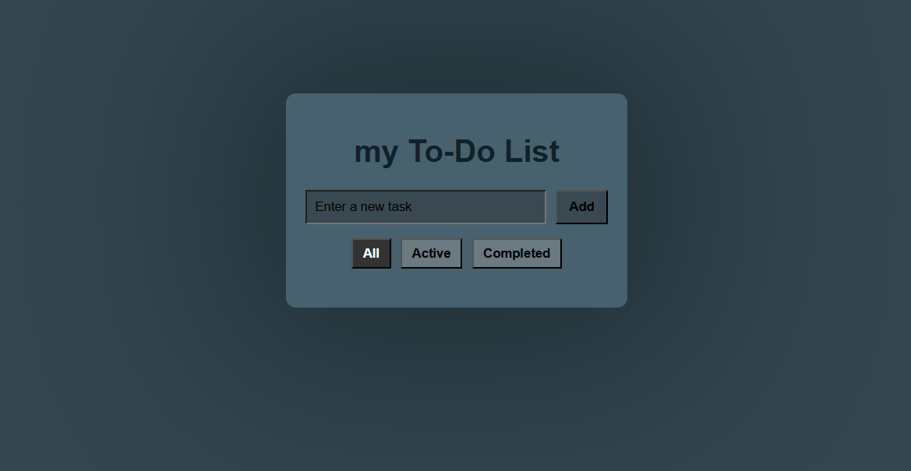
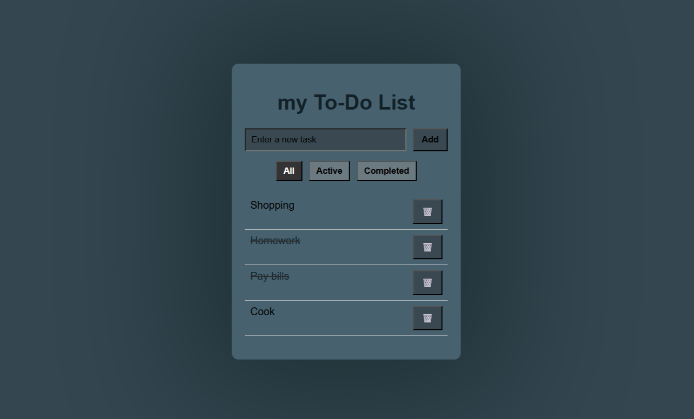
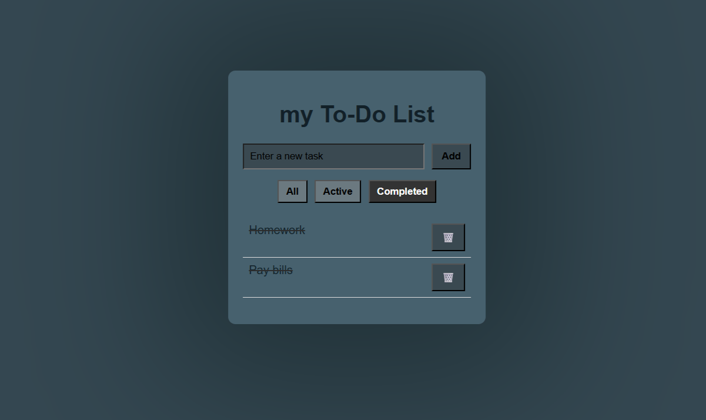

# To-Do List App
Simple To-Do List application built with JavaScript.

## Features
- Add and delete tasks
- Mark tasks as completed
- Persistent data using localStorage
- Filtering categories

## Technologies
- HTML
- CSS
- JavaScript

## Screenshots

## Live Demo
https://giorgostsets.github.io/myTo-DoList/